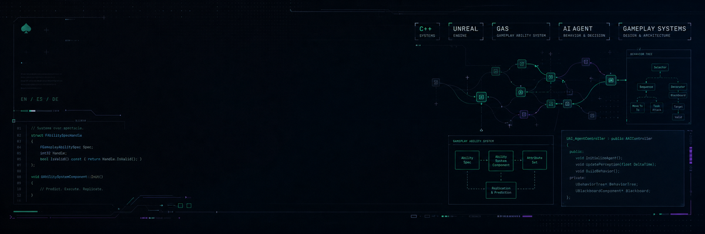

<p align="center">
  
</p>

# Hi, I'm Theseus

Gameplay systems programmer focused on C++, Unreal Engine, GAS, and AI-agent logic.

I like building the layer where design becomes rules, rules become systems, and systems start feeling good in motion.

```text
Theseus
C++ / Unreal Engine / GAS / AI Agents
Gameplay Systems / Game Design Logic
EN / ES / DE
```

## What I Work On

- Unreal C++ gameplay architecture
- Gameplay Ability System design and implementation
- AI behavior, agents, and decision systems
- Combat flow, player-facing mechanics, and game-feel logic
- Tools and workflows that make iteration cleaner

## How I Think About Game Dev

Good gameplay code should support design instead of fighting it. I care about systems that are readable, extensible, and practical during production, especially when designers and programmers need to move fast without turning the project into a mess.

I enjoy the space between technical structure and player experience: abilities, interactions, state, feedback, decision-making, and the small details that make a mechanic feel intentional.

## Current Focus

Right now I'm sharpening my work around:

- Ability systems that stay flexible as a game grows
- AI-agent logic that is understandable and debuggable
- Clean Unreal gameplay frameworks
- Better personal tooling and production habits
- Portfolio-ready game systems and prototypes

## Tech

```text
Languages: C++, Python, Blueprint
Engine:    Unreal Engine
Systems:   GAS, AI behavior, gameplay architecture
Interests: game design, tools, agents, combat, iteration
```

## Links

- Portfolio: coming soon
- LinkedIn: coming soon
- Contact: coming soon
